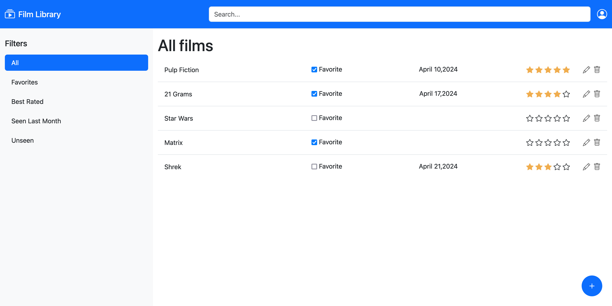

# Lab 08: React Routers

The files in this folder are structured as follows:

- `index.html`: the HTML page on which the React application will be mounted at run-time;
- `main.jsx`: was modified for enabling React Router.
- `src` folder: the file related to the React application.

The desired layout should be similar to the following picture:

In this version of the application:

- Each filter is implemented as a different route.
- When a user press on the "+" button it will be redirect into a new page allowing the user to insert a new movie.
- Clicking on the pencil, close to each entry in the film library, the user will be redirected to a page that allows to modify the data of the selected film.
- Users can modify rating and favorite value directly "in-line".
- Delete operation is enabled.
